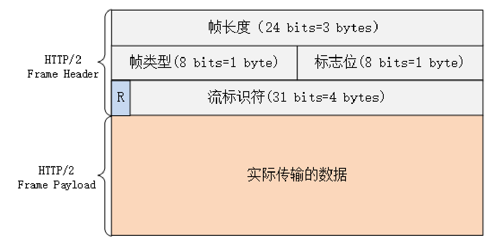

## h5为啥推崇语义化标签
1. 有利于SEO: 爬虫依赖标签来确定关键字的权重，因此可以和搜索引擎建立良好的沟通，帮助爬虫抓取更多的有效信息
2. 提升用户体验： 例如title、alt可以用于解释名称或者解释图片信息。
```html

```
3. 便于团队开发和维护: 语义化使得代码更具有可读性，让其他开发人员更加理解你的html结构，减少差异化。
## css可继承属性值
所有元素可继承：visibility和cursor。
内联元素可继承：letter-spacing、word-spacing、white-space、line-height、color、font、font-family、font-size、font-style、font-variant、font-weight、text-decoration、text-transform、direction。
终端块状元素可继承：text-indent和text-align。
列表元素可继承：list-style、list-style-type、list-style-position、list-style-image。
## z-index会受什么影响
(1):z-index属性只作用在被定位了的元素上。所以如果你在一个没被定位的元素上使用z-index的话，是不会有效果的.
(2)同一个父元素下的元素的层叠效果会受父元素的z-index影响,如果父元素的z-index值很小,那么子元素的z-index值很大也不起作用
失效的情况:
1、父标签 position属性为relative；
2、问题标签无position属性（不包括static）；
3、问题标签含有浮动(float)属性。
4、问题标签的祖先标签的z-index值比较小
## css计数器
> 用于写一个目录结构：
> 1. 定义一个计数器counter-reset:section(可定义初始值)
> 2. 在需要累加的地方定义一下 counter-increment: section(可定义增量)
> 3. 展示 counter(section, '.')(counter可不定义分隔符，counter必须定义)
- counter和counters的区别就是显示时是否显示嵌套
```css
<style type="text/css">
  #demo1 ol {
    counter-reset: section;
    list-style-type: none;
  }
  #demo1 ol li {
    counter-increment: section 1;
  }
  #demo1 ol li:before {
    /* content: counters(section, '.'); */
    content: counter(section, upper-roman)' . ';
    /* content: counter(section, cjk-ideographic) "、"; */
    /* content: counter(section, upper-roman) ". "; */
  }
</style>
```
## 脱离文档流
### 什么是文档流？
将窗体自上而下分成一行一行，并在每行中按从左至右依次排放元素，称为文档流，也称为普通流。
这个应该不难理解，HTML中全部元素都是盒模型，盒模型占用一定的空间，依次排放在HTML中，形成了文档流。
### 什么是脱离文档流？
元素脱离文档流之后，将不再在文档流中占据空间，而是处于浮动状态（可以理解为漂浮在文档流的上方）。
脱离文档流的元素的定位基于正常的文档流，当一个元素脱离文档流后，依然在文档流中的其他元素将忽略该元素并填补其原先的空间。
### 脱离文档流的三种办法
#### float
> 其他盒子会忽略这个元素，但是盒内的文本会给这个元素让出位置，环绕在它周围  
```html
<style>
 .first {
   width: 200px;
   height: 200px;
   border: 3px solid red;
   float: left;
 }
 .second {
   width: 200px;
   height: 100px;
   border: 3px solid blue;
  }
</style>
<div class="first">123</div>
<div class="second"><span>456</span></div>
```
#### absolute
> 比float更加彻底，啥也不会有点儿也不会影响别人
> 没有给他设置位置的话，就在原来的位置最上层
#### fixed
> 完全脱离文档流，相对于浏览器窗口进行定位。
### 清除浮动
1. clear:both
2. BFC
## h标签的嵌套
```html
<h1>殊荣<h3>最帅</h3></h1>
<h1><h3>对对对</h3></h1>
```
## 回流重绘

